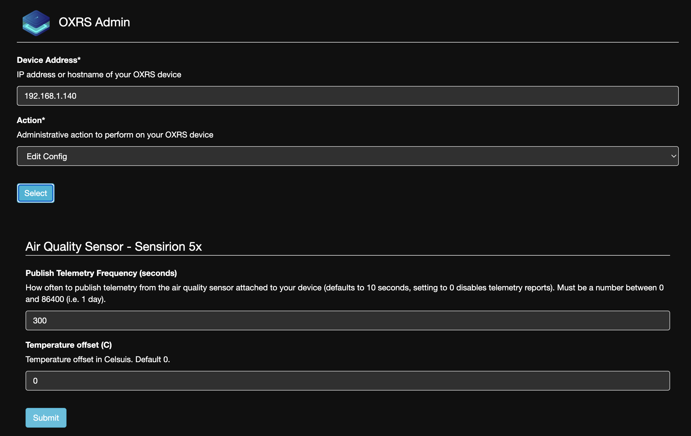
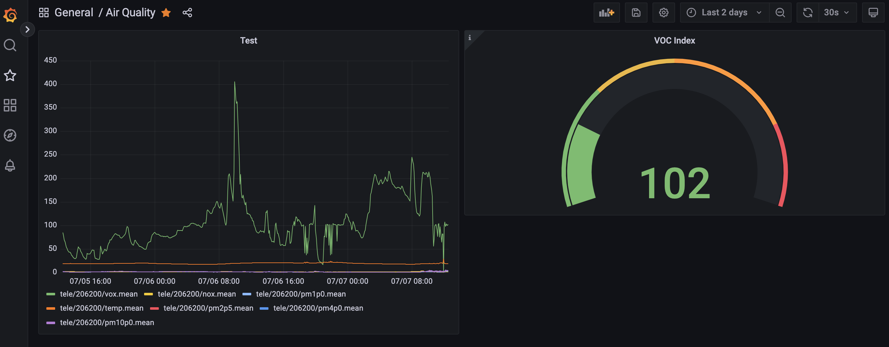

# Raspberry Pi Pico W Air Quality Sensor

Integration of [Sensirion SEN55](https://www.sensirion.com/products/catalog/SEN55) air quality sensor with a Raspberry Pi Pico W.


# Features
- Based on the excellent [OXRS ecosystem](https://oxrs.io/) which provides scaffolding support for API and MQTT integration enabling the following:
    - [OXRS AdminUI](https://github.com/OXRS-IO/OXRS-IO-AdminUI-WEB-APP) and API based automation of configuration, for example


- Support via OXRS UI for the following configuration items
  - Telemetry publishing frequency
  - Offset temperature
- Logging abstraction to enable future integration with Loki or any logging system
- MQTT telemetry to support Grafana integration via NodeRed/InfluxDB


## Future works:

```
config
 - celsius / farenheit
```

```
voc thresholds:
  green : 0   - 149
  yellow: 150 - 249
  orange: 250 - 399
  red:    400 - 500

nox thresholds:
  green : 0-19
  yellow: 20-149
  orange: 150-300
  red: 401-500
```

```
Features
- do pmp* as moving averages given noise 
```

# Credits
First and foremost to Jonathan Oxer and the OXRS team.

Secondly all the excellent library contributors used in the project.

# License

Attribution to SuperHouse Automation Pty Ltd for OXRS ecosystem hardware and software.
