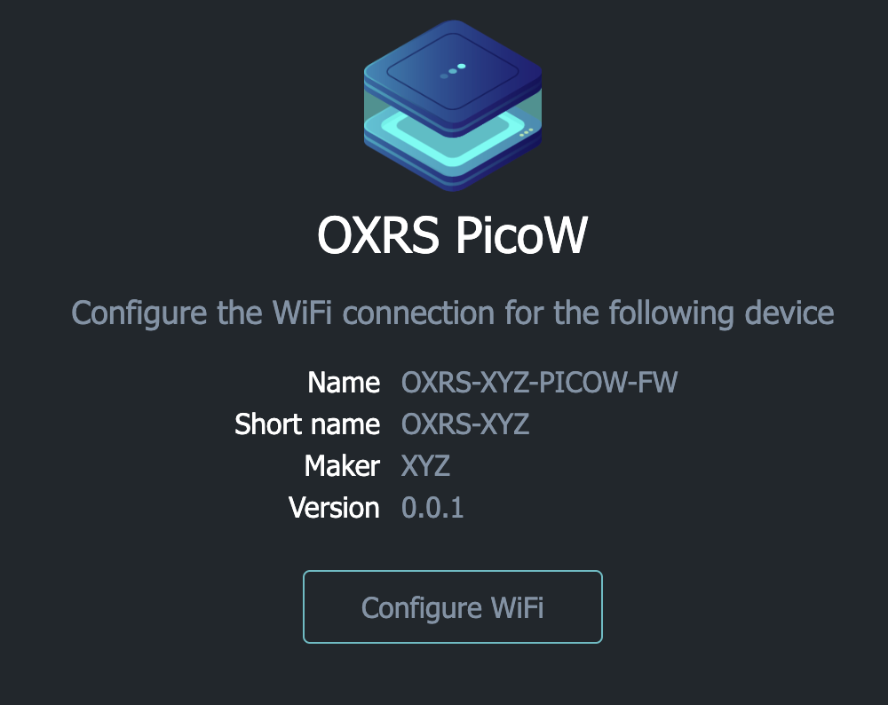
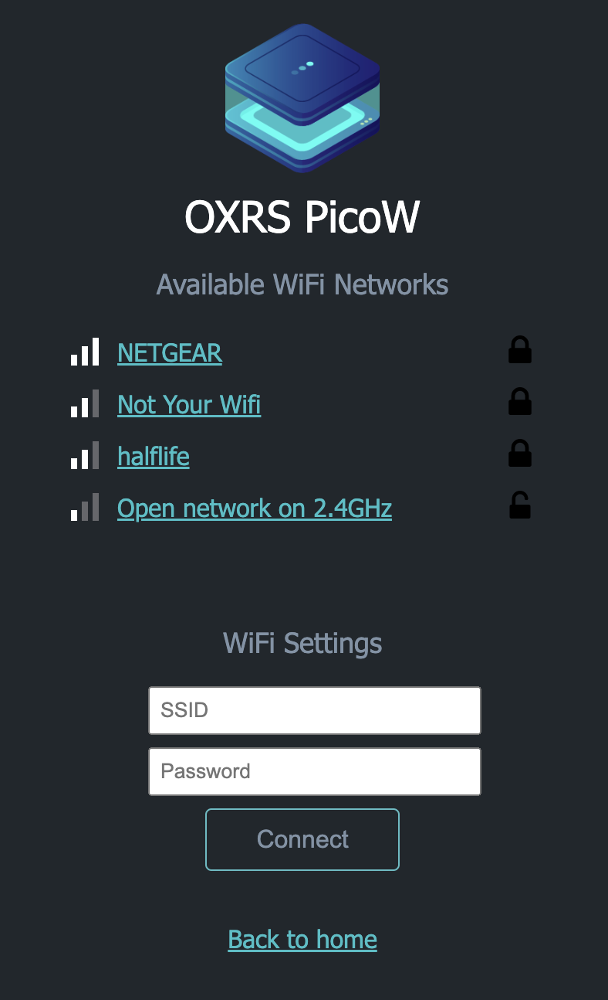
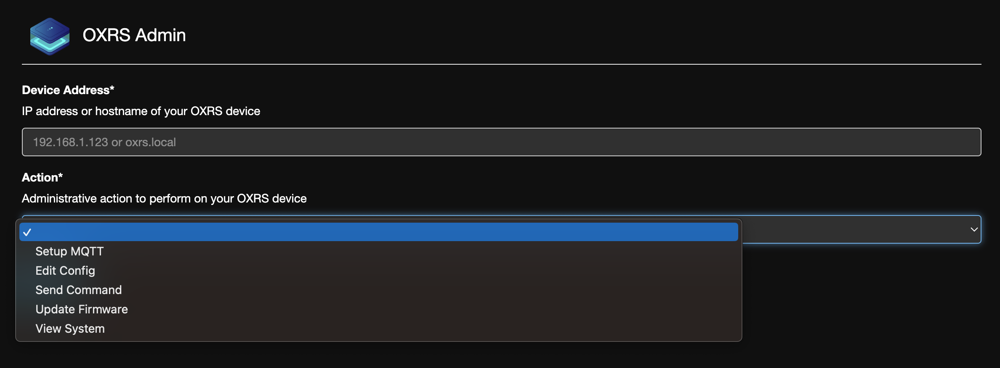

# OXRS-IO-PICO Library

Based on the excellent [OXRS ecosystem](https://oxrs.io/), this library provides scaffolding support for API and MQTT integration for Raspberry Pi Pico W based micro controllers.

Sensors or other devices connected to the PicoW can use this library to obtain key device management features.

## Key Features

- Captive portal to allow configuration of the device to a target WiFi network
- Support for [OXRS AdminUI](https://github.com/OXRS-IO/OXRS-IO-AdminUI-WEB-APP) and API based automation of configuration
- OTA updates via web UI
- MQTT configuration via web UI
- Logging integration with OXRS_LOG library
- Watchdog
- Use of onboard Pico temperature sensor

### Captive Portal

Following a similar approach to the ESP WiFiManager, if no WiFi credentials are found within EEPROM, the PicoW creates an access point with an SSID of `OXRS_WiFi` and password `superhouse`. Once connected a captive portal is presented enabling selection of found WiFi networks and password to be entered. Once validated, these credentials are saved in EEPROM and used to connect on next restart.

The portal home page confirms the device attributes including name, maker and firmware version.

Whilst the captive portal has been tested on iOS, Android and macOS, windows has not. If the portal does not show, entering `http://oxrs.local` into the browser will pull it up.



The portal WiFi page allows configuration of the target network.



WiFi credentials can be erased using the AdminUI which will cause the captive portal to be presented on device restart.

### Admin UI

The admin UI is a static HTML site stored on a client machine that integrates with the OXRS_API to configure the device. Options available are shown below.



### OTA Updates

Over the Air updates can be performed using the AdminUI. LittleFS filesystem is used to store the uploaded firmware and therefore must be large enough to handle the firmware size. This can be configured as follows in the `platform.ini`

```
board_build.filesystem_size = 0.5m
```

### MQTT Configuration

MQTT configuration can be performed using the AdminUI. Note that TLS is not currently supported.

### Watchdog

### Logging via OXRS_LOG

## Development

This section outlines implementation choices and how to extend the library for future use.

### Captive Portal

The templates for the captive portal web assets (e.g. HTML, CSS, images) are defined in [WiFiManagerAssets.h](./src/WiFiManagerAssets.h) where web assets or fragments of HTML are stored as `PROGMEM` variables within flash. These variables are then consumed within [WiFiManager.cpp](./src/WiFiManager.cpp) to hydrate the web assets and perform any dynamic text or style substitutiions using `String` to replace `${variable_name}` with content.

The web assets are derived from web content held under [html](./html). These web assets can be extended and tested in isolation before being encoded into `PROGMEM` variables.

Note the use of EEPROM (used to store WiFi credentials) is [simulated](https://arduino-pico.readthedocs.io/en/latest/eeprom.html), since the Raspberry Pi Pico RP2040 does not come with an EEPROM onboard, it is simulated by using a single 4K chunk of flash at the end of flash space.
